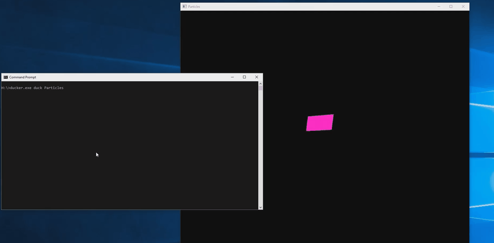

# Ducker
An app, that moves windows behind the desktop icons
# Usage
* `ducker.exe duck "VLC media player"` - duck the window with the provided title beneath the desktop
* `ducker.exe unduck "VLC media player"` - unduck the window (move it back above desktop environment)
* `ducker.exe clear` - after the program beneath the desktop is either killed or unducked, artifacts
   are left behind, and this comand invalidates the desktop to force a redraw.
# Demo

